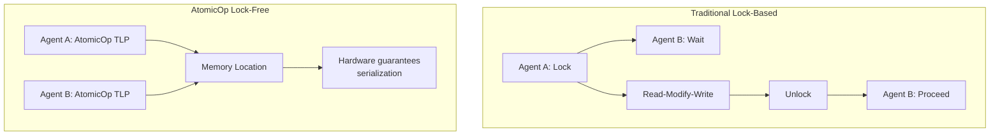
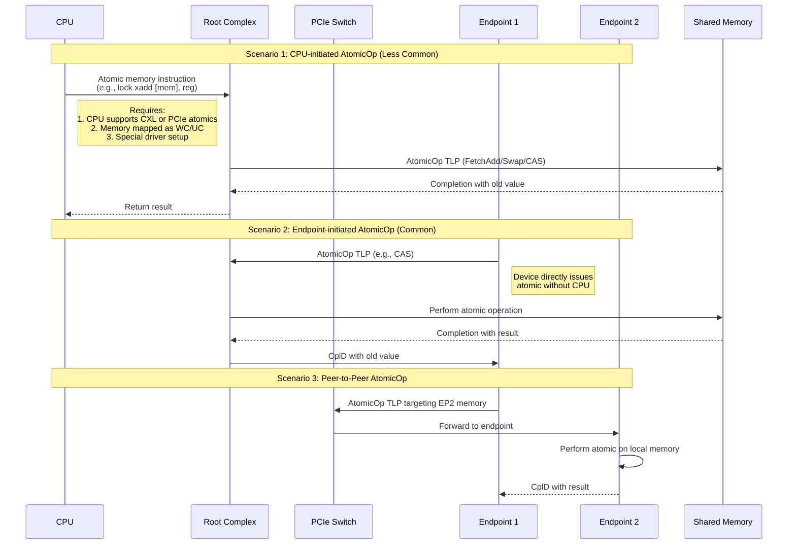

# AtomicOp TLPs in PCIe: Advanced Synchronization Mechanisms

## What Are AtomicOp TLPs?

**AtomicOp TLPs** are specialized transaction types introduced in **PCIe 3.0 (optional)** and **fully standardized in PCIe 4.0+** that enable **lock-free atomic operations** across the PCIe fabric. Unlike regular `MemWr`/`MemRd` which are simple data transfers, AtomicOp TLPs perform **read-modify-write operations** at the target location with **guaranteed atomicity** - meaning no other agent can access the location during the operation.



## Types of AtomicOp TLPs

### **PCIe 4.0 Atomic Operations:**

| AtomicOp Type | Operation | TLP Byte Code | Description |
|--------------|-----------|---------------|-------------|
| **FetchAdd** | Atomic Fetch & Add | 4Ch | `old = *addr; *addr += addend; return old;` |
| **Swap** | Atomic Swap | 4Eh | `old = *addr; *addr = data; return old;` |
| **CAS** | Compare & Swap | 4Dh | `if(*addr == compare) *addr = data; return old;` |

### **PCIe 5.0+ Enhanced Atomics (Optional):**
- **ADD** (Atomic Add without fetch)
- **AND** (Atomic AND)
- **OR** (Atomic OR)
- **XOR** (Atomic XOR)
- **MAX**/MIN (Atomic max/min)

## Who Can Initiate AtomicOp TLPs?

**YES! Both CPU (via RC) and PCIe endpoints can initiate AtomicOp TLPs**, but with different mechanisms and purposes:



## Detailed TLP Structures

### **AtomicOp Request TLP Format:**

```cpp
// AtomicOp TLP Header (4 DW for 64-bit addressing)
struct atomicop_tlp {
    // DW0
    uint8_t  fmt_type;    // 4Xh (X=0,2,4,6 for 32/64-bit, with/without data)
    uint8_t  tc;          // Traffic Class
    uint8_t  attr;        // {RO, ID-Based, No Snoop}
    uint16_t length;      // Always 1 DW for atomic data
    
    // DW1
    uint16_t requester_id;// BDF of initiator
    uint8_t  tag;         // Transaction tag
    uint8_t  byte_enable; // Usually 1111b (4 bytes)
    
    // DW2-3: Address
    uint64_t address;     // 64-bit target address
    
    // DW4: Atomic-specific fields
    union {
        struct {          // For FetchAdd
            uint32_t addend;  // Value to add
        };
        struct {          // For SWAP
            uint32_t data;    // Value to write
        };
        struct {          // For CAS
            uint32_t compare; // Comparison value
            uint32_t data;    // Write value (in DW5)
        };
    };
};
```

### **AtomicOp Completion TLP:**

```cpp
struct atomicop_completion {
    uint8_t  fmt_type;    // 4Ah (Completion with Data)
    uint8_t  tc;          // Echo request TC
    uint8_t  attr;
    uint16_t length;      // 1 DW
    uint16_t completer_id;// BDF of completer
    uint8_t  status;      // Completion status
    uint16_t requester_id;// Original requester
    uint8_t  tag;         // Original tag
    uint32_t lower_addr;  // Lower address bits
    
    uint32_t original_value; // The value BEFORE atomic op
};
```

## Real-World Use Cases

### **1. Multi-GPU Synchronization (NVIDIA NVLink / AMD Infinity Fabric Alternative):**
```cpp
// Without atomics (requires CPU intervention):
while(lock != 0);  // Spin wait - high latency
lock = 1;
// Critical section
lock = 0;

// With PCIe atomics (lock-free):
do {
    expected = 0;
    new_val = 1;
} while(!atomic_CAS(&lock, expected, new_val));
// Critical section
atomic_SWAP(&lock, 0);
```

### **2. RDMA (Remote Direct Memory Access) Network Cards:**
```cpp
// MPI_Accumulate operation across nodes
// Instead of: read → modify → write (3 TLPs)
// Use: 1 AtomicOp FetchAdd TLP

// Traditional (3 TLPs):
// 1. MemRd to get current counter
// 2. CPU adds value
// 3. MemWr to write back

// With atomics (1 TLP):
atomic_FetchAdd(&global_counter, increment_value);
```

### **3. Database Acceleration:**
```sql
-- Atomic increment of sequence counter
-- Each transaction needs unique ID
UPDATE sequences SET value = value + 1 WHERE name = 'txn_id'
-- With PCIe atomics, storage controller can do this
-- without round-trip to CPU
```

## Comparison: CPU vs Endpoint AtomicOp Initiation

| Aspect | CPU-Initiated AtomicOp | Endpoint-Initiated AtomicOp |
|--------|------------------------|-----------------------------|
| **Typical Use** | Heterogeneous computing (CPU+accelerator) | Device-to-device synchronization |
| **Mechanism** | CPU atomic instructions to MMIO space | Device DMA engine generates TLPs |
| **Latency** | Higher (goes through CPU caches) | Lower (direct fabric access) |
| **Setup Required** | Special memory mapping (WC/UC), CXL optional | Device must support AtomicOp capability |
| **Common in** | CXL-attached memory, coherent accelerators | GPUs, NICs, SmartNICs, computational storage |
| **Example** | `lock add [mem], reg` to device memory | GPU atomic to shared buffer |

## Capability Discovery and Configuration

### **AtomicOp Requester Capability Structure:**
```cpp
struct atomic_op_requester_cap {
    uint16_t cap_id = 0004h;  // AtomicOp Requester Capability
    
    // Supported operations
    uint32_t capabilities;
    #define ATOMIC_OP_32BIT_FETCHADD (1 << 0)
    #define ATOMIC_OP_32BIT_SWAP     (1 << 1)
    #define ATOMIC_OP_32BIT_CAS      (1 << 2)
    #define ATOMIC_OP_64BIT_FETCHADD (1 << 3)
    #define ATOMIC_OP_64BIT_SWAP     (1 << 4)
    #define ATOMIC_OP_64BIT_CAS      (1 << 5)
    
    uint32_t control;  // Enable/disable operations
};
```

### **Linux Driver Setup:**
```c
// Check device support
pci_find_ext_capability(pdev, PCI_EXT_CAP_ID_ATOMICOP);

// Enable atomic operations
pci_enable_atomic_ops_to_root(pdev);

// Use in driver
void perform_device_atomic(struct pci_dev *dev, dma_addr_t addr) {
    // Device's DMA engine will generate AtomicOp TLPs
    // when programmed with atomic addresses
    write_dma_desc(dev, ATOMIC_CAS, addr, compare, new_val);
}
```

## Performance Impact and Considerations

### **Advantages:**
1. **Reduced Latency**: 1 TLP vs 2-3 TLPs for read-modify-write
2. **Lock-Free Algorithms**: Enable scalable synchronization
3. **CPU Offload**: Move synchronization to devices
4. **Memory Consistency**: Strong ordering guarantees

### **Challenges:**
1. **Limited Scope**: Only works within PCIe domain
2. **Bandwidth Impact**: AtomicOp TLPs consume more credits
3. **Ordering Complexity**: PCIe ordering rules apply
4. **Debugging Difficulty**: Hardware atomic failures hard to trace

### **Performance Comparison:**
```
Operation               | TLPs | Round Trips | Minimum Latency
-----------------------|------|-------------|-----------------
Simple MemWr           | 1    | 1 (posted)  | ~100ns
Read-Modify-Write      | 3    | 2           | ~300ns
AtomicOp (e.g., CAS)   | 2    | 1           | ~200ns
```

## PCIe Generation Evolution

| PCIe Version | AtomicOp Support | Key Features |
|--------------|------------------|--------------|
| **PCIe 3.0** | Optional (rarely implemented) | 32-bit FetchAdd only |
| **PCIe 4.0** | Mandatory for certain device classes | Full 32/64-bit CAS, SWAP, FetchAdd |
| **PCIe 5.0** | Enhanced atomics (optional) | Bitwise operations (AND, OR, XOR) |
| **PCIe 6.0** | FLIT mode optimizations | Lower latency, better ECC protection |
| **PCIe 7.0** | Coherent integration with CXL 3.0 | Unified atomic namespace |

## Practical Example: GPU Compute Synchronization

```cuda
// CUDA-like pseudo-code using PCIe atomics
__device__ void gpu_atomic_operation(int* counter, int* results) {
    int thread_id = blockIdx.x * blockDim.x + threadIdx.x;
    
    // Each thread atomically increments counter
    int old_val = atomicFetchAdd(counter, 1);
    
    // Use the returned value as unique ID
    results[thread_id] = old_val;
    
    // After all threads complete, last thread signals CPU
    if(thread_id == 0) {
        // Atomic SWAP to signal completion
        atomicSwap(signal_flag, 1);
    }
}

// On CPU side - no polling needed!
wait_for_signal();  // Interrupt or memory notification
```

## Conclusion

**AtomicOp TLPs** represent a sophisticated evolution in PCIe, enabling true **lock-free synchronization** across the fabric. While both CPUs and endpoints can initiate these operations, **endpoint-initiated atomics** are more common and practical for device-to-device communication, while **CPU-initiated atomics** are emerging with CXL for coherent memory models.

The key advantage is reducing multi-TLP sequences to single atomic operations, which is critical for:
- **High-performance computing** (GPU clusters)
- **Low-latency networking** (RDMA, SmartNICs)
- **Distributed storage** (computational storage drives)
- **Hardware accelerators** (AI/ML, FPGA, ASIC)

As PCIe evolves toward CXL convergence, atomic operations will become increasingly important for building scalable, heterogeneous computing systems with efficient synchronization across multiple processing elements.
